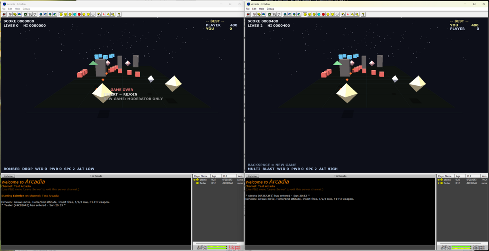

# Echelon: 3D "vertical" scrolling shooter toy for Arcadia

Echelon is a scrolling shooter rendered with OpenGL, and the first
[Arcadia][] toy not developed by Synthetic Reality. It supports co-op
multiplayer, and players can pop in and out of the game at any time.

## Install

Download `toy13.zip` from the GitHub releases page and unzip it in your
Arcadia installation `toys` folder. It will appear as a new "Echelon" toy
in the listing.

## Gameplay

Fly up an endless, procedurally-generated landscape and destroy everything in
your path. The world scrolls forever and gets tougher the longer you survive:
waves grow denser and tougher gunships start to appear.

The play field has **three altitude bands** — low, mid, and high — and altitude
is your main defense. Enemies and their fire occupy a single band, so you dodge
by climbing or descending out of the way:

- **Air enemies** fly scripted paths (weaving, strafing, diving) at a given
  altitude. Your shots only hit air targets on *your* band, so match altitudes
  to attack and change bands to evade.
- **Ground turrets** sit on the deck and lob slow bullets straight up the field.
  They only threaten the low band — climb to fly over them.
- **Obstacles** rise through all three bands. Fly around them, or have a bomber
  clear a path.

Powerups drop as you clear enemies (their pattern is fixed by the game seed, so
every player sees the same drops). Grab them to widen your fire, hit harder,
gain a life, charge your special, or unlock a fourth weapon.

You start with three lives. Lose them all and you can rejoin at zero score, or —
if you're the moderator — start a fresh game to bring the difficulty back down.
Everyone competes on score, and a high-score board tracks each player's best.

It's **co-op multiplayer**: everyone shares one world, players pop in and out at
any time, and the roles are built to synergize — e.g. a bomber carves a corridor
through terrain while fighters sweep the skies.

## Controls

| Key          | Action                                                     |
|--------------|------------------------------------------------------------|
| Arrow keys   | Move                                                       |
| Home / End   | Climb / descend an altitude band                           |
| Insert       | Fire (also: rejoin after losing all your lives)            |
| F1 – F4      | Select weapon (F4 is unlocked by a pickup)                 |
| F5           | Role special                                               |
| 1 / 2 / 3    | Choose role: fighter / bomber / multi-role                 |
| Backspace    | New game — resets difficulty (moderator only)              |

Input only registers while the Arcadia window is focused.

## Roles & weapons

Pick a role with the number keys. Each is strong in one dimension, so a squad
covers more than any one pilot can alone.

- **Fighter** (`1`) — air superiority; can't hit ground targets. Weapons: Pulse,
  Spread, Lance, and Homing (F4). Special: a wide burst that sweeps its band.
- **Bomber** (`2`) — ground attack; bombs arc down and detonate in a radius.
  Weapons: Drop, Cluster, Penetrator, and Carpet (F4). Special: a wide
  terrain-clearing blast that opens a path for the team.
- **Multi-role** (`3`) — mediocre at both air and ground, but handles everything
  solo. Weapons: Blast, Split (a bolt plus a bomb), and Homing (F4).

Powerups: **Width** (wider spread), **Power** (more damage), **1-Up** (extra
life), **Special** (a charge for your F5), and **Weapon** (unlocks F4).

## Build

This toy was developed using the [Arcadia SDK][]. Building requires
nothing more than this source and [w64devkit][] (x86 version):

    $ cmake -B build
    $ cmake --build build

It automatically downloads the SDK. Copy `build/toys/toy13/` into your
Arcadia `toys/` directory to install the toy. The toy run on Windows XP,
but building it requires at least Windows 7 due to CMake.

[Arcadia]: http://www.synthetic-reality.com/arcadia.htm
[Arcadia SDK]: https://github.com/skeeto/arcadia-sdk
[w64devkit]: https://github.com/skeeto/w64devkit
